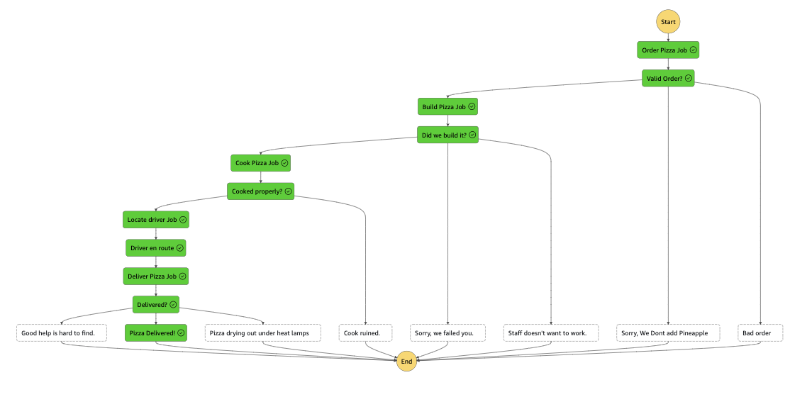

# The Pizza Machine!

This state machine is the framework for a pizza delivery service that could really use some help.  Random events like burnt pizza, staff on strike, or driver getting lost may occur, but the software is infallible, naturally.  Logical next steps are finishing the test suite, adding retries in the event of things like burnt pizza, and building out the notification service to keep the customer informed.

As an afterthought, the process should be modified to be async, initial response with order_id and price, then subsequent steps be communicated to the customer via notifications.  A Standard workflow would be used, which allows for longer than 5 minute duration.  Additionally, the-state-machine-stack.ts is beginning to get unruly and steps should be broken out into modules for maintainability and developer sanity.



`PS - Personally, I love hawiian/pineapple pizza...`

### Testing It Out

Deployed API url for testing:
https://wft00qaml4.execute-api.us-east-2.amazonaws.com/

After deployment you should have an API Gateway HTTP API where on the base url you can send a POST request with a payload in the following format:

```json
// for a succesful execution
{
  "order": {
    "flavour": "pepperoni",
    "size": "large",
    "toppings": ["bacon", "olives", "jalapenos"],
    "address": "1234 Smith St",
    "delivery": true
  }
}

//to see an address failure
{
  "order": {
    "flavour": "pepperoni",
    "size": "large",
    "toppings": ["bacon", "olives", "jalapenos"],
    "address": "Nope",
    "delivery": true
  }
}

//to see a flavour failure
{
  "order": {
    "flavour": "pineapple",
    "size": "large",
    "toppings": ["bacon", "olives", "jalapenos"],
    "address": "Nope",
    "delivery": true
  }
}
```

### Fail Diagram


If you pass in pineapple or hawaiian you should see the step function flow fail in the response payload

The response returned is the raw and full output from the step function so will look something like this:

```json
// A successful execution, note the status of SUCCEEDED
{
  "billingDetails": {
    "billedDurationInMilliseconds": 400,
    "billedMemoryUsedInMB": 64
  },
  "executionArn": "arn:aws:states:us-east-2:210224753726:express:StateMachine2E01A3A5-URsMbJzjRViU:0895f147-51f1-409c-bfe1-2ba0dc089805:048831ab-4a1a-4510-a782-cdf965fd4d53",
  "input": "{\n  \"order\": {\n    \"flavour\": \"pepperoni\",\n    \"size\": \"large\",\n    \"toppings\": [\"bacon\", \"olives\", \"jalapenos\"],\n    \"address\": \"1234 Smith St\",\n    \"delivery\": true\n  }\n}",
  "inputDetails": {
    "__type": "com.amazonaws.swf.base.model#CloudWatchEventsExecutionDataDetails",
    "included": true
  },
  "name": "0895f147-51f1-409c-bfe1-2ba0dc089805",
  "output": "{\"delivered\":true,\"holdForPickup\":false}",
  "outputDetails": {
    "__type": "com.amazonaws.swf.base.model#CloudWatchEventsExecutionDataDetails",
    "included": true
  },
  "startDate": 1.702499450658E9,
  "stateMachineArn": "arn:aws:states:us-east-2:210224753726:stateMachine:StateMachine2E01A3A5-URsMbJzjRViU",
  "status": "SUCCEEDED",
  "stopDate": 1.702499450972E9,
  "traceHeader": "Root=1-657a147a-c149c6d2302acc758d8bb4ec;Sampled=1"
}

// a failed execution, notice status: FAILED and the cause/error properties
{
  "billingDetails": {
    "billedDurationInMilliseconds": 600,
    "billedMemoryUsedInMB": 64
  },
  "cause": "Pizza driver lost your pizza!",
  "error": "Failed To Deliver Pizza",
  "executionArn": "arn:aws:states:us-east-2:210224753726:express:StateMachine2E01A3A5-URsMbJzjRViU:ef4984e7-78ed-4d35-a284-c738e3916f5f:9700599e-1049-44c5-8e2a-9754071b65ce",
  "input": "{\n  \"order\": {\n    \"flavour\": \"pepperoni\",\n    \"size\": \"large\",\n    \"toppings\": [\"bacon\", \"olives\", \"jalapenos\"],\n    \"address\": \"1234 Smith St\",\n    \"delivery\": true\n  }\n}",
  "inputDetails": {
    "__type": "com.amazonaws.swf.base.model#CloudWatchEventsExecutionDataDetails",
    "included": true
  },
  "name": "ef4984e7-78ed-4d35-a284-c738e3916f5f",
  "outputDetails": {
    "__type": "com.amazonaws.swf.base.model#CloudWatchEventsExecutionDataDetails",
    "included": true
  },
  "startDate": 1.702499428802E9,
  "stateMachineArn": "arn:aws:states:us-east-2:210224753726:stateMachine:StateMachine2E01A3A5-URsMbJzjRViU",
  "status": "FAILED",
  "stopDate": 1.702499429358E9,
  "traceHeader": "Root=1-657a1464-80c87b1f174e80d5366ea304;Sampled=1"
}
```

## Useful commands

 * `npm run build`   compile typescript to js
 * `npm run watch`   watch for changes and compile
 * `npm run test`    perform the jest unit tests
 * `npm run deploy`      deploy this stack to your default AWS account/region
 * `cdk diff`        compare deployed stack with current state
 * `cdk synth`       emits the synthesized CloudFormation template
